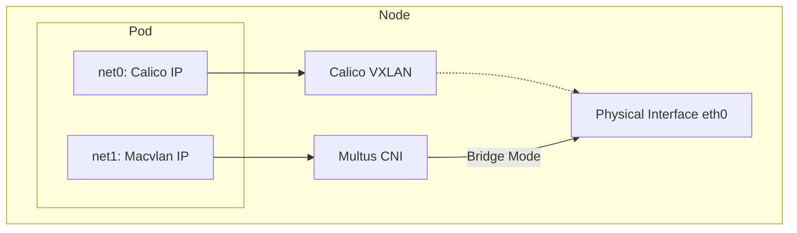
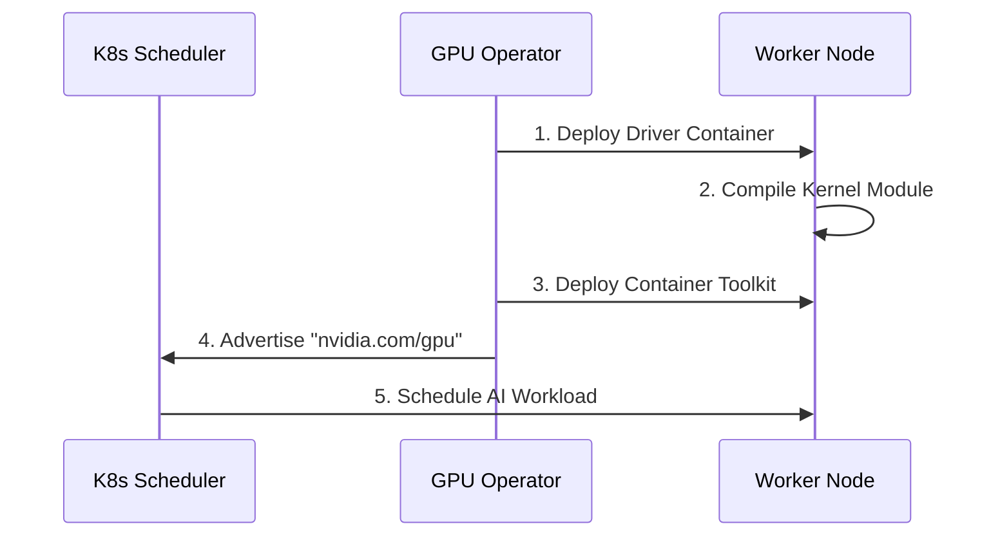

# Production Kubernetes Infrastructure Installation Guide

This document details the step-by-step installation and configuration of a high-availability Kubernetes cluster. It is designed for **DevOps Engineers** and **System Architects** who require a deep understanding of the underlying mechanisms.

**Key Features covered:**
- **OS Tuning**: Kernel optimization for high-throughput container networking.
- **Dual-CNI Network**: Calico (Overlay) + Multus (Physical/Multicast) integration.
- **Hardware Acceleration**: Nvidia GPU Operator with automated driver management.
- **Registry**: High-Availability Harbor deployment with Ingress TLS.

---

## 1. Operating System Preparation

**Objective:** Prepare the Linux host (Ubuntu/CentOS) to serve as a high-performance container runtime environment.

### 1.1 Disable Swap & Tune Kernel Parameters
Kubernetes schedulers require precise memory metrics, which Swap distorts. Additionally, we must enable bridged traffic to traverse the iptables stack for Network Policies to function.

```bash
# 1. Disable Swap
sudo swapoff -a
sudo sed -i '/ swap / s/^\(.*\)$/#\1/g' /etc/fstab

# 2. Load Kernel Modules
cat <<EOF | sudo tee /etc/modules-load.d/k8s.conf
overlay
br_netfilter
EOF

sudo modprobe overlay
sudo modprobe br_netfilter

# 3. Apply Sysctl Params
cat <<EOF | sudo tee /etc/sysctl.d/k8s.conf
net.bridge.bridge-nf-call-iptables  = 1
net.bridge.bridge-nf-call-ip6tables = 1
net.ipv4.ip_forward                 = 1
EOF

sudo sysctl --system
```

#### Technical Rationale

| Configuration | Why is this required? |
| :--- | :--- |
| `swapoff -a` | **QoS Guarantee:** The Kubelet cannot adequately manage resource limits (Requests/Limits) if memory pages can be swapped to disk. Enabling swap can lead to unpredictable latency spikes.[1] |
| `br_netfilter` | **Security:** Enables the interaction between Layer 2 bridge traffic and Layer 3 iptables. Without this, traffic between Pods on the same node would bypass the firewall rules defined in Kubernetes NetworkPolicies.[1] |
| `net.ipv4.ip_forward` | **Routing:** Transforms the host into a router, allowing it to forward packets from the Pod's virtual interface (veth) to the physical network.[2] |

---

## 2. Networking Architecture (CNI)

**Objective:** Enable standard Pod communication via Calico while supporting legacy Multicast workloads via Multus.



### 2.1 Install Calico (Primary CNI)
Calico handles standard Kubernetes traffic (Service IP, DNS, Pod-to-Pod).

```bash
kubectl apply -f https://raw.githubusercontent.com/projectcalico/calico/v3.26.1/manifests/calico.yaml
```

### 2.2 Install Multus & Configure Macvlan (Secondary CNI)
Standard Overlay networks (VXLAN) often drop IGMP packets required for Multicast. We use `macvlan` to expose Pods directly to the physical switch.

```bash
# 1. Install Multus
kubectl apply -f https://raw.githubusercontent.com/k8snetworkplumbingwg/multus-cni/master/deployments/multus-daemonset.yml

# 2. Create Network Attachment Definition
cat <<EOF | kubectl apply -f -
apiVersion: "k8s.cni.cncf.io/v1"
kind: NetworkAttachmentDefinition
metadata:
  name: multicast-conf
  namespace: default
spec:
  config: '{
      "cniVersion": "0.3.1",
      "type": "macvlan",
      "master": "eth0",
      "mode": "bridge",
      "ipam": {
        "type": "whereabouts",
        "range": "192.168.1.0/24"
      }
    }'
EOF
```

#### Technical Rationale

| Component | Function |
| :--- | :--- |
| **Multus** | Acts as a "Meta-CNI" that calls other CNI plugins. It allows a Pod to have multiple network interfaces (`net0`, `net1`, etc.).[3] |
| **Macvlan** | Creates a virtual interface with a unique MAC address directly on the physical `eth0`. This bypasses the NAT/Overlay table, allowing the Pod to send/receive Multicast (IGMP) packets directly from the physical LAN switch.[3] |

---

## 3. Hardware Acceleration (Nvidia GPU)

**Objective:** Automate the management of proprietary Nvidia drivers and container runtimes.



### 3.1 Install Nvidia GPU Operator
We use Helm to deploy the operator. Note that `driver.enabled=true` allows the operator to dynamically compile drivers for the running kernel version.

```bash
# 1. Add Helm Repo
helm repo add nvidia https://helm.ngc.nvidia.com/nvidia
helm repo update

# 2. Install Operator
helm install --wait --generate-name \
     -n gpu-operator --create-namespace \
     nvidia/gpu-operator \
     --set driver.enabled=true \
     --set toolkit.enabled=true
```

#### Technical Rationale

| Setting | Explanation |
| :--- | :--- |
| `driver.enabled=true` | **Kernel Independence:** Instead of installing `.deb`/`.rpm` drivers on the host (which breaks on OS updates), the Operator runs a container that builds the driver module against the *current* kernel headers. This ensures stability across kernel patches.[4] |
| `toolkit.enabled=true` | **Runtime Injection:** Automatically configures `containerd` or `CRI-O` with the `nvidia-container-runtime` hook, allowing containers to request access to `/dev/nvidiaX` devices.[5] |

---

## 4. Private Registry (Harbor)

**Objective:** Deploy a secure, high-availability artifact registry.

### 4.1 Deploy via Helm
We configure Ingress to handle TLS termination to avoid "Insecure Registry" errors on clients.

```bash
helm repo add harbor https://helm.goharbor.io
helm install harbor harbor/harbor \
  --namespace harbor-system --create-namespace \
  --set exposure.type=ingress \
  --set exposure.ingress.hosts.core=registry.corp.local \
  --set externalURL=https://registry.corp.local \
  --set persistence.persistentVolumeClaim.registry.storageClass=longhorn
```

#### Technical Rationale

| Parameter | Impact |
| :--- | :--- |
| `exposure.type=ingress` | **Security:** Offloads SSL/TLS encryption to the Ingress Controller (e.g., Nginx). This centralizes certificate management (via Cert-Manager) and avoids configuring complex certificates directly inside Harbor containers.[6] |
| `externalURL` | **Client Compatibility:** Docker clients use this URL for token authentication. Mismatches here will cause `docker login` to fail even if the network is reachable.[7] |